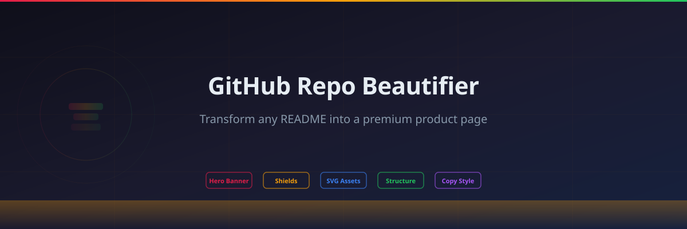
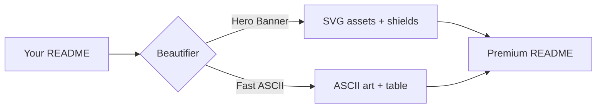

<div align="center">


# 🎨 GitHub Repo Beautifier


**Transform any GitHub README into a premium product page with strong hierarchy, branded visuals, and fast scanability.**

[Quick Start](#-quick-start) - [Formats](#-formats) - [Sections](#-section-reference) - [Assets](#-visual-assets) - [Examples](#-real-examples) - [Roadmap](#-roadmap)



</div>

> GitHub Repo Beautifier does **not** generate generic READMEs. It reads your actual project and builds a landing-page rhythm that fits your stack, your audience, and your goals.

> [!NOTE]
> All examples in this repository are real projects. The skill adapts to each repo's content instead of forcing one template onto everything.

---

## 💡 Concept

Most README guides dump a template and call it a day.

**GitHub Repo Beautifier** is built around a stricter rule: **read first, beautify second**.

It teaches Hermes to:

1. inspect the existing README and project structure,
2. determine the project type (web app, library, tool, visualization),
3. choose the right format (Hero Banner or Fast ASCII),
4. generate matching visual assets (SVG mark, hero banner, architecture flow),
5. write product-oriented copy with concrete numbers,
6. structure sections for scanability and hierarchy,
7. verify GitHub rendering before declaring done.

That makes it useful for:
- open-source projects that need public discovery
- portfolio repos that must impress in 20 seconds
- internal tools being promoted to the community
- anyone who says **"make my repo look premium"** and expects more than a badge dump

---

## ✨ Features

### Two format modes
Full Hero Banner style or Fast ASCII style - chosen based on project needs and asset availability.

### Auto-generated assets
SVG logo mark, hero banner, and architecture diagram tailored to each project.

### Shield/badge orchestration
Intentional badge rows: product info + tech stack.

### Section rhythm
14-section structure with emoji-led headings for instant scanability.

### Anti-slop copy
Concrete numbers, active voice, phrase rotation - no corporate filler.

### GitHub rendering verification
Checks dark mode, link validity, and visual hierarchy before finalizing.

### Mermaid diagrams
Native GitHub rendering - no external tools needed.



### Project structure tree
Visual tree for instant codebase orientation.

```
github-repo-beautifier/
├── assets/
│   ├── beautifier-mark.svg
│   └── beautifier-hero.svg
├── references/
│   ├── complete-example.md
│   └── html-footer-snippet.md
├── README.md
├── SKILL.md
├── LICENSE
└── CHANGELOG.md
```

### GitHub stats widgets
Dynamic badges showing stars, forks, last commit - update automatically.


### Dark-mode images
Automatic light/dark switching via `picture` element.

```html
<picture>
  <source media="(prefers-color-scheme: dark)" srcset="assets/hero-dark.svg">
  
</picture>
```

### Cross-promo footer
Author attribution + related projects for discovery.

### Asset checklist
What to generate, in what format, and why. See [Visual Assets](#-visual-assets).

### GIF demo
Show the tool in action with animated screenshots.

```markdown

```

### Auto-generated TOC
Auto-generated anchor navigation for long READMEs.

- [Concept](#-concept)
- [Features](#-features)
- [Quick Start](#-quick-start)
- [Tech Stack](#-tech-stack)
- [Roadmap](#-roadmap)


---

## 🚀 Quick Start

Install directly from GitHub:

```bash
hermes skills install https://raw.githubusercontent.com/$OWNER/github-repo-beautifier/main/SKILL.md -y
```

Load it in Hermes:

```text
/skill github-repo-beautifier
```

Or simply ask:

```text
Make my repo look premium.
```

The skill should inspect your project structure and README, then apply the right format.

---

## 🎨 Formats

### Format A: Hero Banner Style

For projects with visual identity - premium tool, open-source product, or portfolio piece.

**Ingredients:**
- Centered logo mark (SVG, 92×92)
- `for-the-badge` shields: product info + tech stack
- Inline navigation anchors
- Wide SVG hero banner
- Framing block with callout
- 14-section structure
- Architecture/workflow diagram
- Author footer with cross-promo

| **Best for:** demo-optimizer, demo-rag-bot, any public tool or library

### Format B: Fast ASCII Style

For quick wins without custom graphics - scripts, internal tools, or rapid prototypes.

**Ingredients:**
- ASCII banner (≤3 lines)
- `flat-square` shields
- Italic pitch block
- Emoji tree structure
- Status table (✅ 🟡 ❌)
- Author footer

| **Best for:** demo-cli-tool, data pipelines, CLI tools

---

## 📐 Section Reference

| # | Section | When to use |
|---|---------|-------------|
| 1 | Hero block | Every repo. Logo, badges, pitch, nav. |
| 2 | Framing | When you need to set expectations or disclaimers. |
| 3 | Concept | When the "why" is not obvious. |
| 4 | Features | Every repo. Dense feature table. |
| 5 | Quick Start | Every repo. One-command install/run. |
| 6 | Core Mechanism | When architecture matters (RAG, routing, pipeline). |
| 7 | Package/Structure | When readers need to know what files matter. |
| 8 | At a Glance | When you want a signal/value summary table. |
| 9 | Tech Stack | When the stack is part of the identity. |
| 10 | Workflow | When the flow is complex or unconventional. |
| 11 | What It Improves | When benefits need explanation. |
| 12 | Example Output | When the response/output shape matters. |
| 13 | Quality Checks | When verification is a selling point. |
| 14 | Roadmap | When the project is evolving. |
| 15 | Contributing | When you want external contributions. |
| 16 | License | Every repo. MIT + footer. |

---

## 🎨 Visual Assets

| Asset | Format | Dimensions | Purpose |
|-------|--------|------------|---------|
| Logo mark | SVG | 92×92 | Identity above H1, favicon candidate |
| Hero banner | SVG/PNG | 1200×400 | Top visual, dark-mode friendly |
| Architecture flow | SVG | 1000×280 | System diagram, pipeline view |
| Social preview | PNG | 1280×640 | GitHub repo Settings → Social preview |

**Design rules:**
- Dark gradient backgrounds (`#0f0f1a` → `#1a1a2e`)
- Accent gradient: `#e11d48` → `#f59e0b` → `#22c55e` (beautifier) or `#7c3aed` → `#2563eb` (project-specific)
- Subtle grid pattern at 10% opacity
- JetBrains Mono or Segoe UI typography
- No clutter, one focal point

---

## 🏆 Real Examples

| Repo | Format | What was applied |
|------|--------|------------------|
| demo-optimizer | Hero Banner | Logo, hero, architecture flow, 14 sections |
| demo-rag-bot | Hero Banner | Full asset pack, RAG pipeline diagram |
| demo-cli-tool | Fast ASCII | ASCII banner, emoji tree, status table |

See `references/` for full example READMEs.

---

## 🧠 At a Glance

| Signal | Value |
|--------|-------|
| **Primary purpose** | Turn plain READMEs into premium product pages |
| **Best for** | Public repos, portfolio projects, open-source tools |
| **Core mechanism** | Inspect → Format select → Asset generate → Structure → Verify |
| **Formats** | Hero Banner (full assets) or Fast ASCII (text-only) |
| **Assets generated** | Logo mark, hero banner, architecture diagram |
| **Copy style** | Product-oriented, concrete numbers, anti-slop |
| **Verification** | GitHub rendering check before finalize |

---

## 🏗️ Tech Stack

| Layer | Technology |
|-------|------------|
| Skill format | Markdown + YAML frontmatter |
| Visual assets | SVG (dark-mode friendly) |
| Badge generation | Shields.io |
| Distribution | GitHub raw install + skill tap |
| Quality gate | GitHub Actions README/link checks |

---

## 🛡️ Quality Checks

- README/link lint workflow on push
- Dark mode rendering verification
- Generic public examples instead of personal defaults
- Structured visual assets for GitHub rendering
- Reusable reference pack with real examples

---

## 🗺️ Roadmap

- [x] Public GitHub repository
- [x] Two-format system (Hero Banner + Fast ASCII)
- [x] SVG asset generation guidelines
- [x] 14-section reference structure
- [x] Real-world examples (demo-optimizer, demo-rag-bot, demo-cli-tool)
- [x] Anti-slop copy rules
- [x] GitHub rendering verification
- [ ] Web-based README preview tool
- [ ] Automated asset generation from project metadata
- [ ] Theme system (dark/light/adaptive SVGs)
- [ ] Community-contributed example gallery

---

## 📚 Sources & Inspiration

This skill was built on top of real-world experience and existing community work.

| Source | What it provides |
|--------|----------------|
| [readme-guidelines](https://github.com/maximosovsky/readme-guidelines) by maximosovsky | Checklist and templates for crafting beautiful GitHub READMEs. Serves as the structural foundation for section ordering, visual hierarchy, and formatting decisions. |

---

## 🤝 Contributing

Fork → branch → add examples, improve copy rules, or extend formats → PR.

Good contribution areas:
- Additional real-world example READMEs
- New format variants (minimal, academic, enterprise)
- Better SVG asset templates
- Automated rendering verification recipes
- Multi-language README variants

---

## 📄 License

MIT. See [LICENSE](LICENSE).

---

<div align="center">

**Built for the open-source community**

</div>
