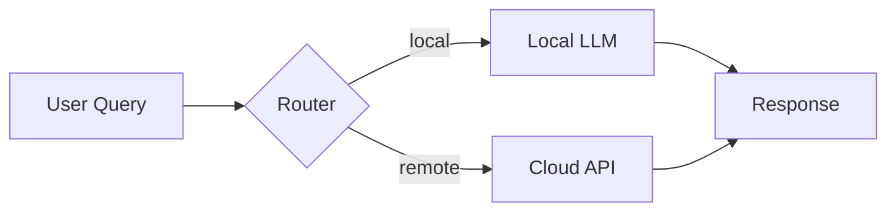

# GitHub Repo Beautifier

Transform any GitHub repository README into a premium product page with strong hierarchy, branded visuals, and fast scanability.

**IMPORTANT: After pushing, ALWAYS set GitHub topics via API.** They appear as blue label pills under the repo name and are critical for discoverability. Details in the "GitHub Topics" section below.

## When to use

- Creating a new public repo
- Updating an existing repo to look professional and premium
- Preparing portfolio, demo, or open-source projects
- Any repository that others will discover and evaluate

## Recommended Format: Hero Banner Style

### 1. Centered hero block

```markdown
<div align="center">


# Project Name


**One-line pitch that explains value in under 15 words.**

[Quick Start](#quick-start) - [Features](#features) - [Architecture](#architecture) - [Tech Stack](#tech-stack) - [Roadmap](#roadmap)


</div>
```

**Rules:**
- `for-the-badge` shields for product info (status, type, license)
- `for-the-badge` tech shields with logos (Python, TypeScript, etc.)
- Max 10 badges total
- Inline navigation anchors separated by `-` (hyphen), NOT `---` or `---`
- Hero banner: wide SVG/PNG, dark-mode friendly

### 2. Framing block

```markdown
> Project does **not** assume X. It inspects Y and only then recommends Z.

> [!NOTE]
> Public examples are intentionally generic.
```

### 3. Section structure (in order)

| # | Section | Content |
|---|---------|---------|
| 1 | Concept | Why exists, what makes it different |
| 2 | Features | Dense feature table |
| 3 | Quick Start | One-command install/run |
| 4 | Core Mechanism | Architecture, lanes, or workflow |
| 5 | Package/Structure | What files matter |
| 6 | At a Glance | Signal/value summary table |
| 7 | Tech Stack | Layer/technology table |
| 8 | Workflow | ASCII flow or diagram |
| 9 | What It Improves | Benefit table |
| 10 | Example Output | Sample output shape |
| 11 | Quality Checks | What's verified |
| 12 | Roadmap | Checklist with done / pending |
| 13 | Contributing | How to contribute |
| 14 | License | License + author footer |

### Tables style
- Short dense cells
- Feature / Description pattern
- Max 2-3 columns
- No paragraph-length cells

### Code blocks
- Specify language
- Use for install, quick start, config examples

### Details blocks
- Hide secondary info: advanced install, environment notes, optional steps

### Visual assets
| Asset | Format | Size | Purpose |
|-------|--------|------|---------|
| Logo mark | SVG | 92x92 | Identity above H1 |
| Hero banner | SVG/PNG | Wide, responsive | Top visual |
| Architecture flow | SVG | Wide | System diagram |
| Social preview | PNG | 1280x640 | GitHub repo settings |

### Copy style
- Crisp, product-oriented, no corporate cliches
- Active voice: "It inspects..." not "It is designed to inspect..."
- Concrete numbers when possible
- NO em-dashes `---` in navigation or lists - use hyphens `-` instead

### Footer
```markdown
---

<div align="center">

**Built by [Your Name](https://github.com/YOURNAME)**

</div>
```

## Advanced Visual Features

### 1. Mermaid diagrams (native GitHub)

GitHub natively renders Mermaid. Use for architecture, flowcharts, sequence diagrams.

```markdown

```

**Types supported:** flowchart, sequenceDiagram, classDiagram, stateDiagram, erDiagram, gantt, pie, gitGraph

### 2. Animated GIF demos

Show the tool in action. Record terminal or browser, convert to GIF, host on:
- GitHub repo raw URL (assets/demo.gif)
- Cloudinary
- Gyazo / Imgur

```markdown

```

### 3. Project structure tree

Visual tree of the codebase for instant orientation.

```markdown
```
project/
--- src/
|   --- core/
|   |   --- engine.py
|   |   --- router.py
|   --- utils/
--- tests/
--- docs/
--- README.md
```
```

Or use `tree` ASCII:
```
project/
--- README.md
--- pyproject.toml
--- src/
    --- __init__.py
    --- main.py
    --- modules/
        --- module_a.py
        --- module_b.py
```

### 4. Stats widgets

Dynamic badges powered by shields.io endpoints or GitHub APIs:

```markdown


```

### 5. GitHub profile / contribution widgets

```markdown


```

### 6. Workflow / CI badges

```markdown


```

### 7. Screenshot comparison (before/after)

For redesign projects - side-by-side screenshots:

```markdown
| Before | After |
|--------|-------|
|  |  |
```

### 8. Auto-generated Table of Contents

For long READMEs, add TOC anchor links:

```markdown
- [Concept](#concept)
- [Quick Start](#quick-start)
- [Features](#features)
- [Architecture](#architecture)
- [API Reference](#api-reference)
- [Roadmap](#roadmap)
```

Place right after hero block, before Concept.

### 9. Dark-mode aware images

```markdown
<picture>
  <source media="(prefers-color-scheme: dark)" srcset="assets/diagram-dark.svg">
  <source media="(prefers-color-scheme: light)" srcset="assets/diagram-light.svg">
  
</picture>
```

## Alternative: Fast ASCII Format

When full assets aren't available, use `flat-square` shields + ASCII art:
1. ASCII banner (3 lines max)
2. `flat-square` shields row
3. Italic pitch
4. Emoji tree structure
5. Status table (done / pending / blocked)
6. Author footer

See `references/complete-example.md` for this variant.

## Critical Rules

1. **Never expose private config** as defaults in public READMEs
2. **Never modify third-party originals directly** - create new repo/branch
3. **Preserve original CSS/JS** when adapting visualizations
4. **Deployed versions stay untouched** - create v2 for changes
5. **Verify `git remote -v`** before any modifications
6. **No emojis in H1/H2 headings**
7. **Dark mode friendly** colors
8. **All links must work**
9. **Use hyphens `-` NOT em-dashes `---`** in navigation, lists, tables

## Anti-slop Rules

- Rotate opening phrases: done, shipped, ready, live, finished
- Avoid: "As you can see", "It is important to note", "Do not forget"
- Concrete numbers: "16 files, 6936 lines" not "many changes"
- Vary status emoji: done, active, shipped, launched, target
- NEVER use AI signpost phrases: "In conclusion", "Overall", "To summarize"

## GitHub Topics (auto-generation)

After pushing the repository, generate and set topics via GitHub API.

### What topics do
- Blue label pills under repo name on GitHub - instant discoverability
- Power search filtering by topic
- Required for trending/explore visibility

### How to generate topics
Extract from: project purpose + tech stack + license + domain + audience.

**Template:**
- 1 primary tech: `python`, `typescript`, `javascript`, `go`, `rust`...
- 1 product type: `chatbot`, `dashboard`, `cli-tool`, `api`, `rag`...
- 1 audience domain: `philosophy`, `finops`, `mlops`, `devops`, `ai-agent`...
- `open-source` (always)
- Stack specifics: `fastapi`, `langchain`, `qdrant`, `nextjs`, `react`...
- Maximum 20 topics, each 35 chars max, lowercase, hyphen

### API call (after `git push`)
```bash
export GHTOK=$(gh auth token)
curl -s -X PUT "https://api.github.com/repos/$OWNER/$REPO/topics" \\
  -H "Accept: application/vnd.github.mercy-preview+json" \\
  -H "Authorization: token ${GHTOK}" \\
  -H "Content-Type: application/json" \\
  -d '{"names":["python","chatbot","rag","open-source"]}'
```

### Verify
Go to `https://github.com/$OWNER?tab=repositories` - topics appear as blue pills under repo name.

**Rule: Never skip topics.** They are part of the premium presentation.

## References

- `references/complete-example.md` - ASCII variant example
- `references/html-footer-snippet.md` - HTML footer for visualizations

## Process

1. Read existing README
2. Determine project type and audience
3. Choose format: Full Hero Banner style or Fast ASCII style
4. Select advanced features (Mermaid, GIFs, stats widgets, TOC, dark-mode images)
5. Create/restructure README with proper sections
6. Generate/update visual assets if needed
7. Set GitHub topics via API
8. Verify GitHub rendering (dark mode, mobile)
9. Commit and push
